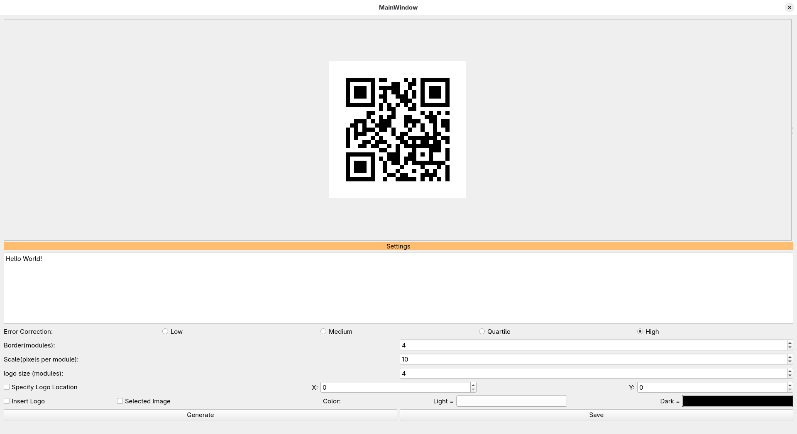
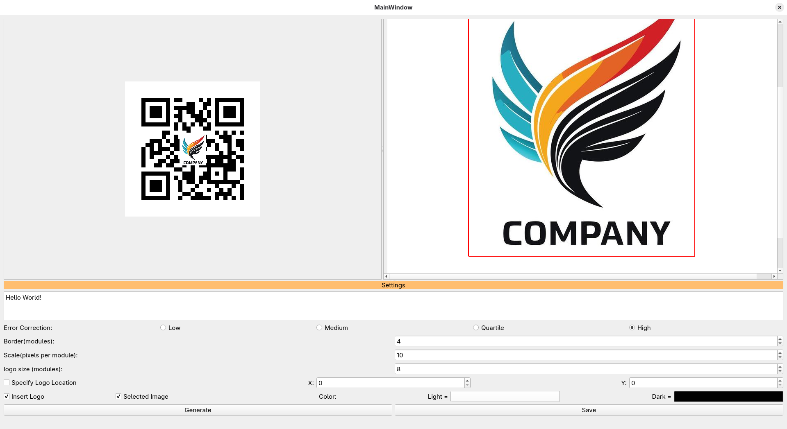

# qr_code_generator
***

Uses [nayuki's QR code library](https://github.com/nayuki/QR-Code-generator) to generate QR codes and allows you to insert a logo. Logo size and location are adjustable. Location defaults to the middle of the QR code. Placing the logo will introduce errors so depending on it's size and location there is a chance the QR code won't scan. Care should be taken when inserting a logo, it is possible to generate working QR codes.

## Application Interface:

\
*Note that in the above image the logo palette is hidden you must move your mouse to the left until the arrows appear then click and drag mouse to the right*  
\
*Note once the logo pallette is visible you can right click it and select load image. After an image is loaded you can place logo bounds (shown in red) using the right click menu.*

## QR CODE Examples:

